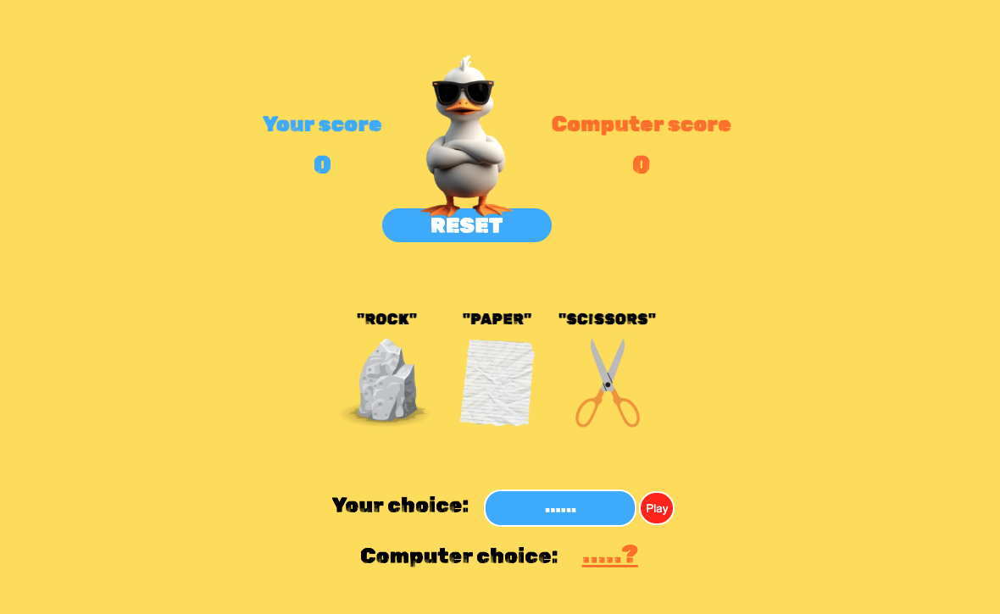

# Rock, Paper, Scissors Game

A simple and interactive **Rock, Paper, Scissors** game built using HTML, CSS, and Javascript. The user type their choice, the computer generates a random one, and the game determines the winner. 
- -> Play now: https://main.d3p2i3dzubtud.amplifyapp.com/

---

## Features
- User vs Computer game
- Manual user input (Rock, Paper, Scissors)
- Score tracking for both user and computer
- Display computer choice
- Result message (Win/lose/tie)
- Reset button to restart

---

## Installation & Usage
1. git clone git@github.com:MassowNdiaye/Rock_Paper_Scissors.git
2. open index.html 
3. Start playing

- -> Play without installing: https://main.d3p2i3dzubtud.amplifyapp.com/